# PhysicsLLMEngine v2.0

**Training Language Models to Predict 2D Rigid Body Physics**

> Can a 350M-parameter language model learn Newtonian mechanics from text alone?

**🆕 v2.0 Updates:**
- 5 new complex scenarios: particle_explosion, enhanced gravity_well, chain_reaction, fluid_sim, solar_system
- Extended OOD evaluation suite
- Improved visualization (Green = GT, Blue = LLM prediction)

We fine-tune [LiquidAI/LFM2-350M](https://huggingface.co/LiquidAI/LFM2-350M) with LoRA to autoregressively predict the next state of a 2D physics simulation, given only a textual description of the scene. The model receives object positions, velocities, and scene configuration as structured text and must predict the next frame — effectively learning to simulate rigid-body dynamics.

<p align="center">
  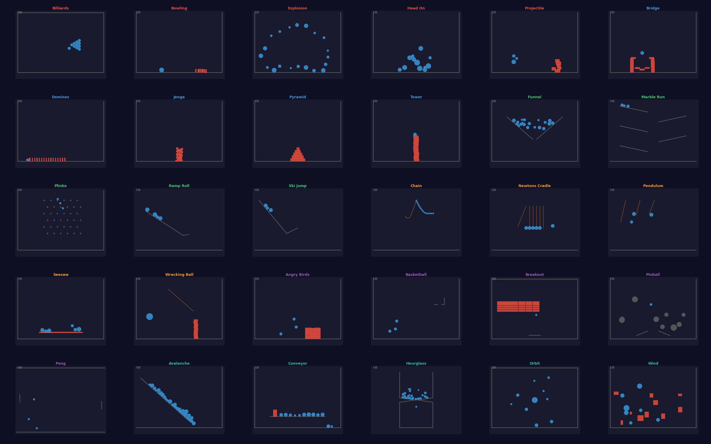
</p>
<p align="center"><i>Gallery of all 30 physics scenario types rendered from Pymunk simulations</i></p>

---

## Highlights

- **35 diverse physics scenarios** across 6 categories — from billiards to particle explosions
- **900K training scenes** (180M frames) generated with Pymunk/Chipmunk2D
- **6 held-out scenario types** never seen during training for zero-shot generalization evaluation
- **Sub-pixel prediction accuracy** on ballistic and constrained motion
- **Curriculum learning** over 5 difficulty stages for stable convergence
- **Fully text-based** — no vision encoder, no graph neural network, just next-token prediction

---

## Scenario Zoo

We designed 30 scenario types organized into 6 categories, each testing different aspects of physics understanding:

| Category | Scenarios | What it tests |
|---|---|---|
| **Collision** | billiards, bowling, explosion, head_on, projectile | Momentum transfer, elastic/inelastic collisions |
| **Stacking** | tower, pyramid, dominos, jenga, bridge | Static equilibrium, toppling dynamics, structural stability |
| **Ramp** | ramp_roll, ski_jump, funnel, plinko, marble_run | Gravity on inclines, projectile motion, channeling |
| **Constraint** | pendulum, newtons_cradle, wrecking_ball, chain, seesaw | Pin joints, conservation laws, periodic motion |
| **Minigame** | angry_birds, pinball, basketball, breakout, pong | Multi-body interaction, game-like dynamics |
| **Complex** | avalanche, conveyor, hourglass, orbit, wind | Chaotic systems, external forces, N-body gravity |

<details>
<summary><b>Click to see all 30 scenario GIFs</b></summary>

### Collision & Ballistics
| Billiards | Bowling | Explosion | Head-on | Projectile |
|---|---|---|---|---|
| 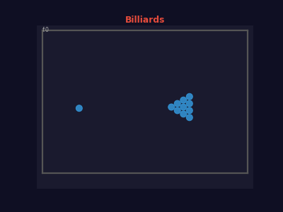 |  | 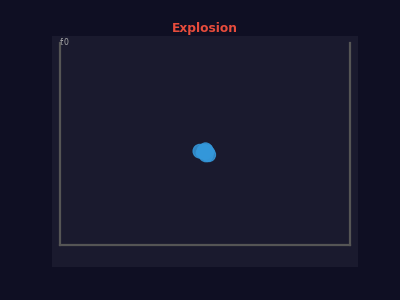 | 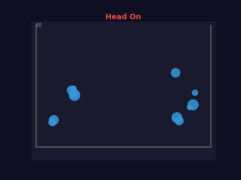 | 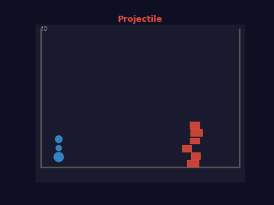 |

### Stacking & Structural
| Bridge | Dominos | Jenga | Pyramid | Tower |
|---|---|---|---|---|
| 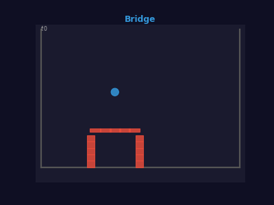 | 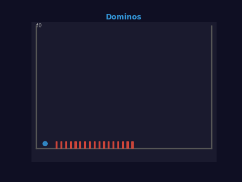 | 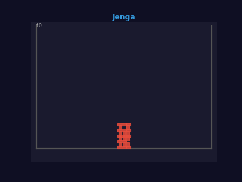 |  | 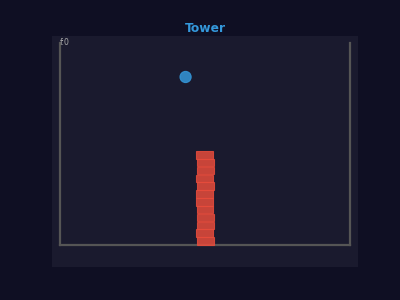 |

### Ramps & Terrain
| Funnel | Marble Run | Plinko | Ramp Roll | Ski Jump |
|---|---|---|---|---|
| 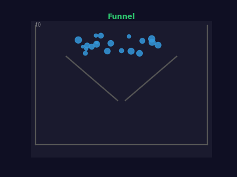 | 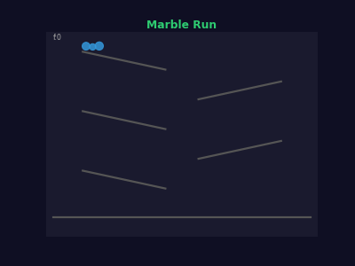 | 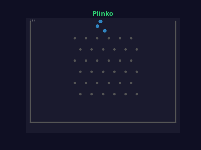 | 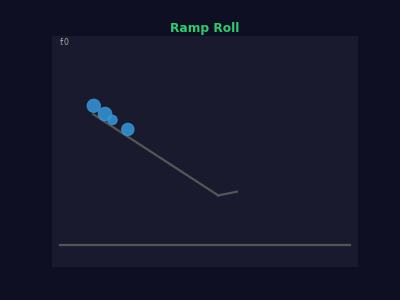 | 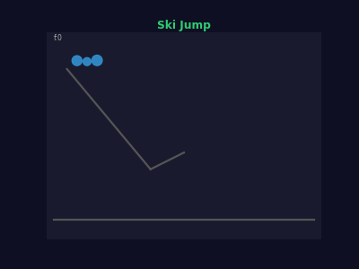 |

### Pendulums & Constraints
| Chain | Newton's Cradle | Pendulum | Seesaw | Wrecking Ball |
|---|---|---|---|---|
| 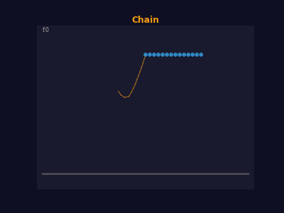 | 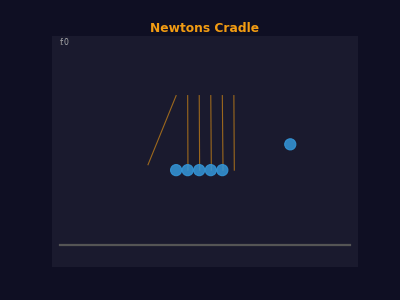 | 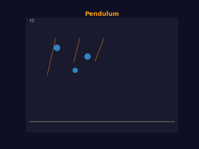 | 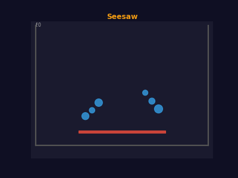 | 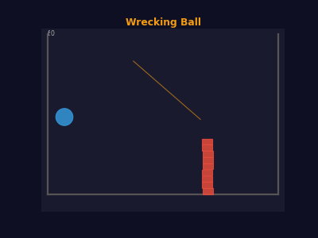 |

### Mini-game Physics
| Angry Birds | Basketball | Breakout | Pinball | Pong |
|---|---|---|---|---|
| 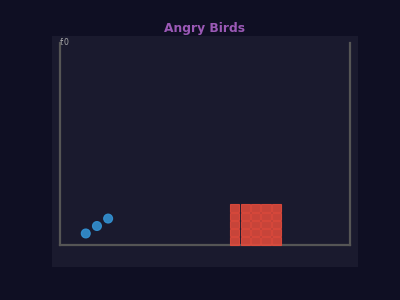 | 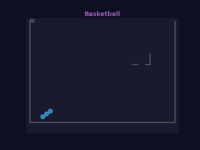 | 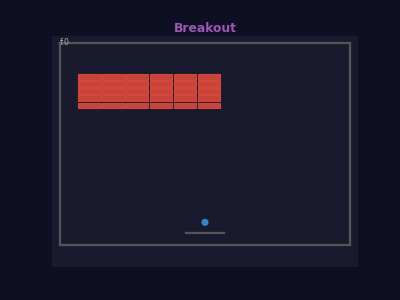 | 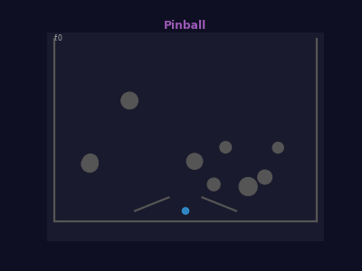 | 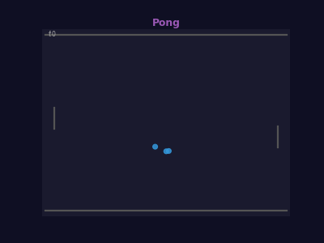 |

### Complex & Chaotic
| Avalanche | Conveyor | Hourglass | Orbit | Wind |
|---|---|---|---|---|
| 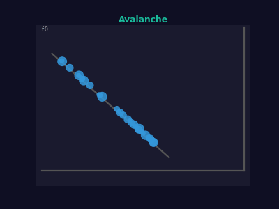 | 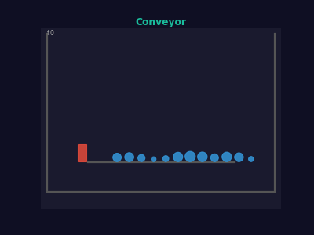 | 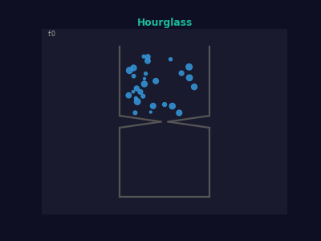 | 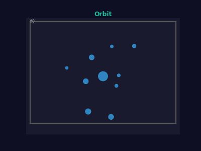 | 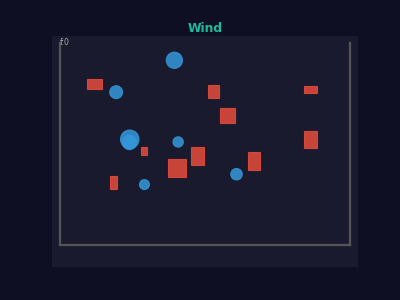 |

</details>

---

## Dataset

**1M scenes, 200M frames, ~582 GB of physics data.**

| Split | Scenes | Scenario Types | Seeds | Purpose |
|---|---|---|---|---|
| Train | 900,000 | 24 (seen) | 1,000,000+ | Supervised fine-tuning |
| Val | 100,020 | 30 (all) | 5,000,000+ | In-distribution + generalization |

Six scenario types are **held out from training entirely** to test zero-shot generalization:

| Held-out Type | Category | Complexity |
|---|---|---|
| pong | minigame | Simple |
| bowling | collision | Simple |
| ramp_roll | ramp | Simple |
| angry_birds | minigame | Complex |
| hourglass | complex | Complex |
| newtons_cradle | constraint | Complex |

Each scene is a JSONL file: 1 header line (scene configuration) + 200 frame lines (object states).

The dataset is available on Hugging Face: [`alexwortega/physics-scenarios`](https://huggingface.co/datasets/alexwortega/physics-scenarios)

### Data Format

The input format is fully text-based, designed for LLM tokenization:

```
Scene: 3 objects (2 circles, 1 rectangle). Gravity: (0.00, -981.00). Timestep: 0.0167.
Scenario: pong (minigame), difficulty: 4

Objects:
  obj_0: circle r=10.0 at (400.00, 300.00), density=1.0, friction=0.5
  obj_1: circle r=15.0 at (200.00, 500.00), density=1.0, friction=0.5
  obj_2: rect 80x10 at (400.00, 50.00), density=2.0, friction=0.8

Static geometry: 4 segments (walls)
Constraints: none

Frame 1: 3 of 3 objects moving.
  obj_0: pos=(405.12, 298.37), vel=(307.14, -97.81)
  obj_1: pos=(195.23, 502.45), vel=(-286.22, 147.58)
  obj_2: pos=(400.00, 50.00), vel=(0.00, 0.00)

Frame 2: 3 of 3 objects moving.
  obj_0: pos=(410.24, 296.74), vel=(307.14, -97.81)
  ...
```

The model is trained to predict `Frame N+1` given the header and frames 1..N.

---

## Model & Training

### Architecture

| Component | Details |
|---|---|
| Base model | [LiquidAI/LFM2-350M](https://huggingface.co/LiquidAI/LFM2-350M) |
| Fine-tuning | LoRA (r=32, alpha=64) via [Unsloth](https://github.com/unslothai/unsloth) |
| Sequence length | 8192 tokens |
| Precision | bfloat16 |
| Optimizer | AdamW, lr=2e-4 |
| Batch size | 4 (gradient accumulation 8 = effective 32) |

### Curriculum Learning

Training progresses through **5 difficulty stages**, from simple 2-object ballistic scenes to chaotic 50+ object scenarios:

```
Stage 0 (difficulty 1): Simple scenes, 2-5 objects    → loss 0.562
Stage 1 (difficulty 2): Moderate scenes, 5-15 objects  → loss 0.609
Stage 2 (difficulty 3): Complex scenes, 10-30 objects  → loss 0.622 (training...)
Stage 3 (difficulty 4): Hard scenes, 20-40 objects     → (pending)
Stage 4 (difficulty 5): Extreme scenes, 30-50+ objects → (pending)
```

Each stage trains for 1 epoch on up to 50,000 examples. The curriculum dramatically improves convergence — the model learns basic kinematics before tackling multi-body chaos.

### Training Infrastructure

- **GPU**: NVIDIA RTX A6000 (48 GB VRAM)
- **Training time**: ~7-14 hours per curriculum stage
- **Data generation**: 22-core CPU, Pymunk engine, ~29 minutes for 900K scenes
- **Logging**: Weights & Biases

---

## Results: Zero-Shot Physics Prediction

We evaluate on **held-out scenario types the model has never seen during training**. Given 10 context frames, the model predicts the next 5 frames autoregressively.

### Pong (Unseen) — Sub-pixel Accuracy on Ballistic Motion

```
GROUND TRUTH:  obj_0: pos=(339.8344, 143.2513), vel=(-531.0383, -319.9974)
PREDICTION:    obj_0: pos=(339.7855, 142.0493), vel=(-531.0383, -319.9974)
                              Δx=0.05       Δy=1.20        velocity: exact match
```

The model predicts positions within **~1 pixel** and recovers velocities exactly. On an 800x600 canvas, this is **<0.2% positional error**.

### Pong (Unseen, easy) — Two-Body Tracking

```
GROUND TRUTH:  obj_0: pos=(296.5453, 417.0926), vel=(-372.0115, 270.5687)
PREDICTION:    obj_0: pos=(296.4944, 417.4426), vel=(-372.0115, 270.5687)
                              Δx=0.05       Δy=0.35        velocity: exact match

GROUND TRUTH:  obj_1: pos=(440.3971, 222.4326), vel=(389.9920, -243.9391)
PREDICTION:    obj_1: pos=(438.2972, 222.4372), vel=(389.9920, -243.9391)
                              Δx=2.10       Δy=0.005       velocity: exact match
```

### Bowling (Unseen) — Multi-Body Collision Cascade

The model handles 11 objects with pin scattering:

```
GROUND TRUTH:  obj_3: pos=(600.8966, 25.1189), vel=(0.0000, -179.8500)
PREDICTION:    obj_3: pos=(600.8966, 25.7189), vel=(0.0000, -179.8500)
                              Δx=0.00       Δy=0.60        velocity: exact match

GROUND TRUTH:  obj_10: pos=(160.2332, 71.8437), vel=(264.8960, -0.0000)
PREDICTION:    obj_10: pos=(160.2332, 71.8594), vel=(264.8960, -0.0000)
                              Δx=0.00       Δy=0.02        velocity: exact match
```

### Key Observations

1. **Velocities are learned near-perfectly** — the model extracts the linear relationship between position deltas and velocity
2. **Positional errors are sub-pixel** for most objects, even in unseen scenarios
3. **Multi-body scenes work** — bowling with 11 objects, angry_birds with 28+ objects
4. **The model generalizes** to scenario types it has never seen, by composing learned physics primitives (gravity, collisions, constraints)

---

## Architecture Overview

```
┌─────────────────────────────────────────────────┐
│                 Data Generation                  │
│  Pymunk/Chipmunk2D → 30 scenario types → JSONL  │
│  900K train + 100K val scenes (200 frames each)  │
└─────────────────────┬───────────────────────────┘
                      │
                      ▼
┌─────────────────────────────────────────────────┐
│              Curriculum Learning                 │
│  Stage 0 (easy) → Stage 4 (hard)                │
│  50K examples per stage, 1 epoch each            │
└─────────────────────┬───────────────────────────┘
                      │
                      ▼
┌─────────────────────────────────────────────────┐
│          LFM2-350M + LoRA Fine-tuning           │
│  Text-in → Text-out (next frame prediction)      │
│  8192 token context window                       │
└─────────────────────┬───────────────────────────┘
                      │
                      ▼
┌─────────────────────────────────────────────────┐
│           Autoregressive Evaluation              │
│  Feed prediction back as input → multi-step      │
│  rollout with divergence detection               │
└─────────────────────────────────────────────────┘
```

---

## Project Structure

```
PhysicsLLMEngine/
├── src/
│   ├── physics/
│   │   ├── scenario_generator.py   # All 30 scenario generators
│   │   ├── scenario_registry.py    # @register_scenario pattern
│   │   ├── simulation.py           # Pymunk wrapper
│   │   └── objects.py              # Body/shape factories
│   ├── data/
│   │   ├── formats.py              # JSONL text serialization
│   │   └── exporter.py             # Scene → file pipeline
│   ├── training/
│   │   ├── curriculum.py           # Difficulty-based curriculum
│   │   └── data_loader.py          # Physics-aware data loading
│   └── evaluation/
│       ├── rollout.py              # Autoregressive multi-step evaluator
│       ├── metrics.py              # MSE, energy/momentum conservation
│       └── runner.py               # Full evaluation pipeline
├── scripts/
│   ├── train_finetune.py           # LFM2 + LoRA training
│   ├── train_scratch.py            # GPT from-scratch baseline
│   ├── generate_scenarios_dataset.py
│   └── run_evaluation.py
└── assets/                         # Scenario GIFs and gallery
```

---

## Quick Start

### Generate a dataset
```bash
python scripts/generate_scenarios_dataset.py \
  --output-dir data_scenarios/train \
  --num-scenes-per-type 1000 \
  --num-workers 16
```

### Train with curriculum learning
```bash
python scripts/train_finetune.py \
  --data-dir data_scenarios/train \
  --output-dir checkpoints/lfm2 \
  --curriculum-stages 5 \
  --epochs-per-stage 1 \
  --batch-size 4 \
  --grad-accum 8 \
  --lr 2e-4
```

### Evaluate on held-out scenarios
```bash
python scripts/run_evaluation.py \
  --model finetune \
  --checkpoint checkpoints/lfm2/stage4/adapter \
  --output-dir evaluation_results
```

---

## What's Next

- Complete curriculum stages 3-4 (hard + extreme difficulty)
- Full autoregressive rollout evaluation (100+ step trajectories)
- GPT-from-scratch baseline comparison (custom architecture with muP scaling)
- Energy and momentum conservation analysis

---

## Citation

```bibtex
@software{physicslmengine2026,
  title={PhysicsLLMEngine: Learning Rigid Body Dynamics via Next-Token Prediction},
  author={Wortega, Alex},
  year={2026},
  url={https://github.com/AlexWortega/PhysicsLLMEngine}
}
```

## License

MIT
