<h1 align="center">⚙️ PhysicsLLMEngine</h1>

<p align="center">
  <b>Teaching a 350M-parameter language model to simulate 2D rigid body physics — from text alone.</b>
</p>

<p align="center">
  <a href="https://huggingface.co/AlexWortega/lfm2-scenarios"></a>
  <a href="https://huggingface.co/AlexWortega/lfm2-scenarios-ONNX"></a>
  <a href="https://huggingface.co/AlexWortega/lfm2-scenarios-GGUF"></a>
  <a href="https://huggingface.co/datasets/AlexWortega/physics-scenarios-packed"></a>
  <a href="https://github.com/AlexWortega/PhysicsLLMEngine"></a>
</p>

<p align="center">
  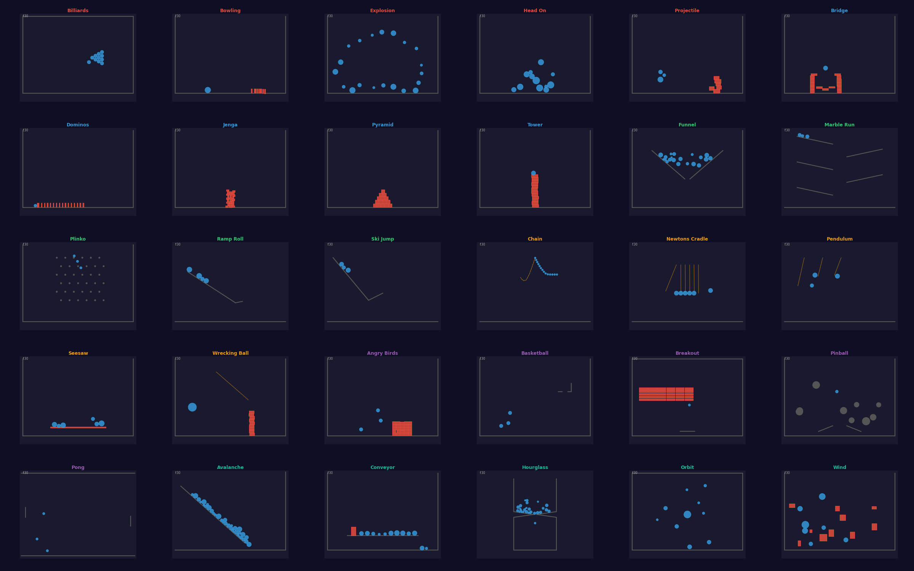
</p>

---

<h2 align="center">🚀 Key Numbers</h2>

<p align="center">
  <b>30 scenario types &nbsp;·&nbsp; 900K training scenes &nbsp;·&nbsp; 180M frames &nbsp;·&nbsp; ~582 GB of physics data</b><br/>
  <b>Sub-pixel positional accuracy (&lt;0.2%) on zero-shot held-out scenarios</b>
</p>

---

## ✨ Highlights

| | |
|---|---|
| 🎯 **30 diverse scenarios** | Billiards, towers, pendulums, angry birds, orbit, hourglass and more |
| 📐 **Text-only input** | No vision encoder, no GNN — pure next-token prediction |
| 🎓 **Curriculum learning** | 5 difficulty stages: 2-obj ballistics → 50-obj chaos |
| 🔬 **Zero-shot generalization** | 6 held-out scenario types never seen during training |
| 🌐 **Runs in the browser** | WebGPU/WASM via transformers.js — no server needed |
| ⚡ **350M params** | Fine-tuned [LiquidAI/LFM2-350M](https://huggingface.co/LiquidAI/LFM2-350M) with LoRA |

---

## 🎬 Scenario Zoo

<details open>
<summary><b>All 30 Scenarios — click to collapse</b></summary>

### 💥 Collision & Ballistics
| Billiards | Bowling | Explosion | Head-on | Projectile |
|:---:|:---:|:---:|:---:|:---:|
| 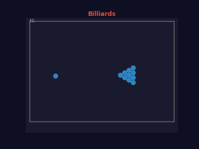 | 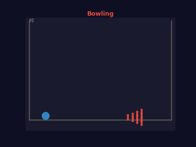 | 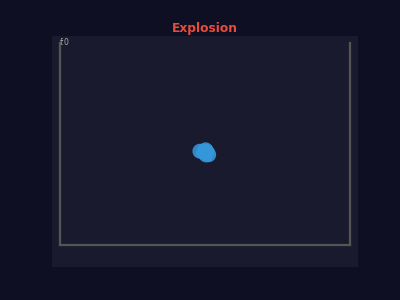 | 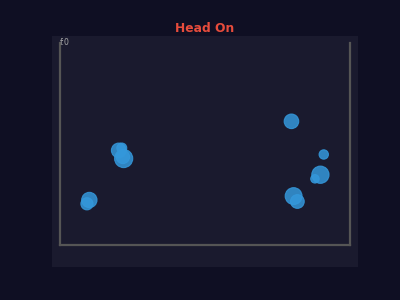 | 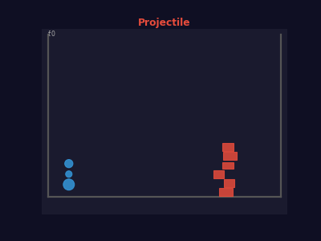 |

### 🏗️ Stacking & Structural
| Bridge | Dominos | Jenga | Pyramid | Tower |
|:---:|:---:|:---:|:---:|:---:|
| 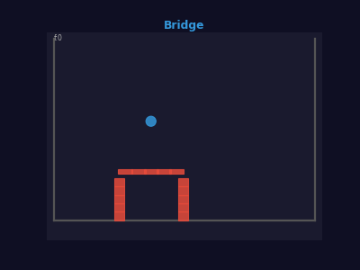 | 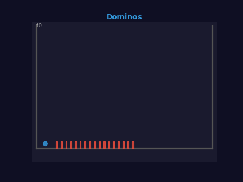 | 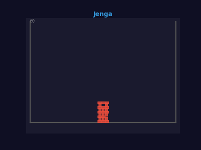 |  | 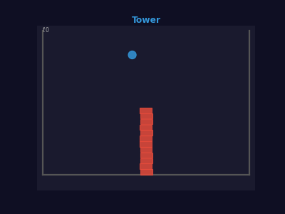 |

### 🎿 Ramps & Terrain
| Funnel | Marble Run | Plinko | Ramp Roll | Ski Jump |
|:---:|:---:|:---:|:---:|:---:|
| 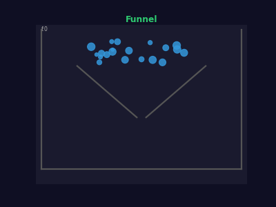 | 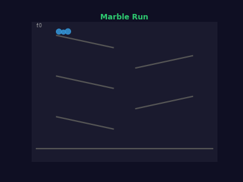 | 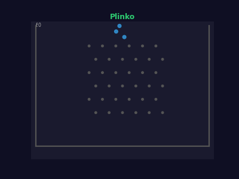 | 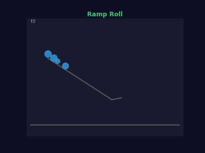 | 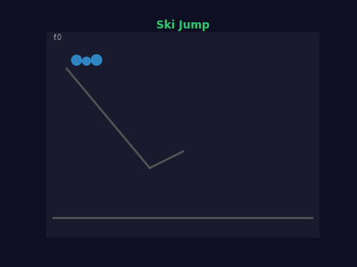 |

### 🔗 Pendulums & Constraints
| Chain | Newton's Cradle | Pendulum | Seesaw | Wrecking Ball |
|:---:|:---:|:---:|:---:|:---:|
| 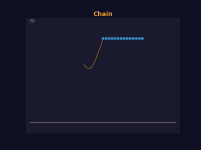 | 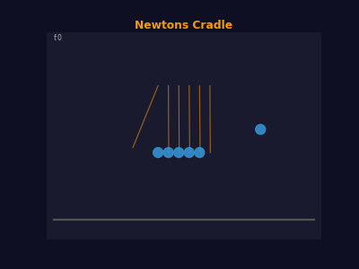 | 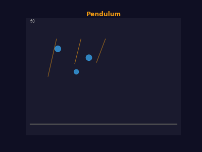 | 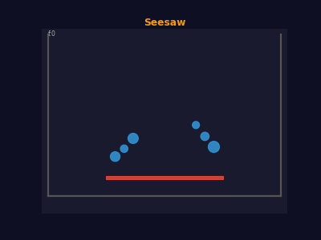 | 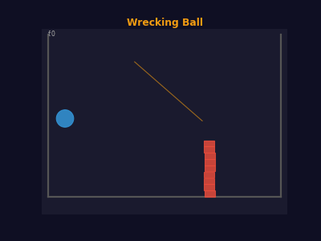 |

### 🕹️ Mini-game Physics
| Angry Birds | Basketball | Breakout | Pinball | Pong |
|:---:|:---:|:---:|:---:|:---:|
| 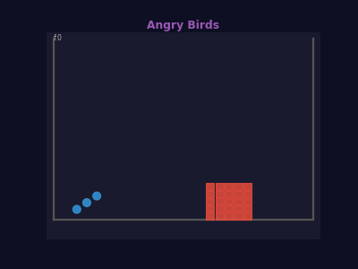 | 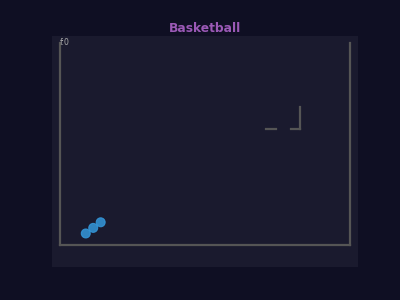 | 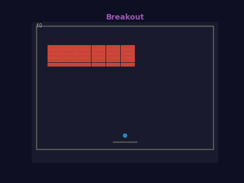 | 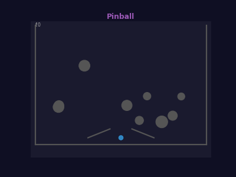 | 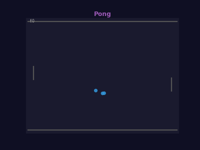 |

### 🌀 Complex & Chaotic
| Avalanche | Conveyor | Hourglass | Orbit | Wind |
|:---:|:---:|:---:|:---:|:---:|
| 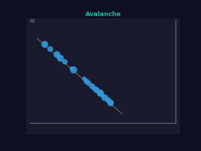 | 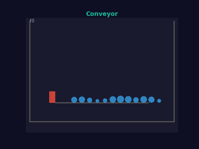 | 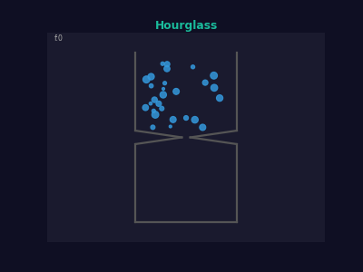 | 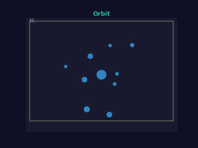 | 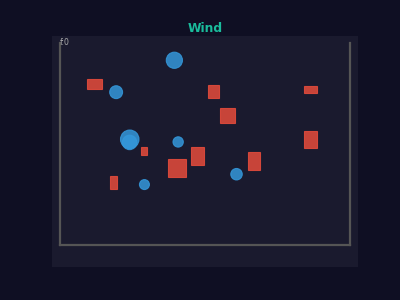 |

</details>

---

## 🗃️ Dataset

**[AlexWortega/physics-scenarios-packed](https://huggingface.co/datasets/AlexWortega/physics-scenarios-packed)** · **[AlexWortega/physics-scenarios-raw](https://huggingface.co/datasets/AlexWortega/physics-scenarios-raw)**

| Split | Scenes | Scenario Types | Purpose |
|---|---|---|---|
| **Train** | 900,000 | 24 (seen) | Supervised fine-tuning |
| **Val** | 100,020 | 30 (all) | In-dist + zero-shot generalization |

Six scenario types are **held out from training entirely**:

> `pong` · `bowling` · `ramp_roll` · `angry_birds` · `hourglass` · `newtons_cradle`

Each scene = 1 JSONL header + 200 frame lines. The model receives frames 1..N and must predict frame N+1 in plain text:

```
Scene: Billiards: cue ball strikes a triangle of 21 balls.
Gravity: (0.0, 0.0)
Timestep: 0.01667
Type: billiards  Difficulty: 3

Frame 1: All objects at rest.
  obj_0: pos=(500.0000, 300.0000), vel=(800.0000, 0.0000)
  obj_1: pos=(522.8631, 286.8000), vel=(0.0000, 0.0000)
  ...

Frame 2: Objects in motion.
  obj_0: pos=(513.3340, 300.0000), vel=(800.0000, 0.0000)
  ...

Predict next frame:
```

---

## 🧠 Model & Training

### Downloads

| Format | Link | Size | Use case |
|---|---|---|---|
| Merged weights | [AlexWortega/lfm2-scenarios](https://huggingface.co/AlexWortega/lfm2-scenarios) | ~700 MB | Python / inference |
| ONNX q4 | [AlexWortega/lfm2-scenarios-ONNX](https://huggingface.co/AlexWortega/lfm2-scenarios-ONNX) | 458 MB | Browser (WebGPU/WASM) |
| GGUF Q4_K_M | [AlexWortega/lfm2-scenarios-GGUF](https://huggingface.co/AlexWortega/lfm2-scenarios-GGUF) | 216 MB | llama.cpp / local |
| Base model | [LiquidAI/LFM2-350M](https://huggingface.co/LiquidAI/LFM2-350M) | — | Reference |

### Architecture

| Component | Details |
|---|---|
| Base | LiquidAI/LFM2-350M (Liquid Foundation Model) |
| Fine-tuning | LoRA r=32 α=64 via [Unsloth](https://github.com/unslothai/unsloth) |
| Context | 8 192 tokens |
| Precision | bfloat16 |
| Optimizer | AdamW 8-bit, lr=2e-4 |
| Batch | 4 × grad-accum 8 = effective 32 |

### Curriculum Learning

```
Stage 0  difficulty 1  2–5 obj     50 000 examples  → loss 0.562 ✅
Stage 1  difficulty 2  5–15 obj    50 000 examples  → loss 0.609 ✅
Stage 2  difficulty 3  10–30 obj   50 000 examples  → loss 0.622 ✅
Stage 3  difficulty 4  20–40 obj   50 000 examples  → (training)
Stage 4  difficulty 5  30–50+ obj  50 000 examples  → (pending)
```

### Infrastructure

- **GPU** — NVIDIA RTX A6000 (48 GB VRAM)
- **Training time** — ~7–14 h per curriculum stage
- **Data generation** — 22-core CPU, Pymunk, ~29 min for 900K scenes
- **Logging** — Weights & Biases

---

## 📊 Results: Zero-Shot Physics Prediction

Evaluated on 6 held-out scenario types the model **never saw during training**.

### Pong — Sub-pixel accuracy on ballistic motion

```
GROUND TRUTH   obj_0: pos=(339.8344, 143.2513)  vel=(-531.0383, -319.9974)
PREDICTION     obj_0: pos=(339.7855, 142.0493)  vel=(-531.0383, -319.9974)
                            Δx = 0.05  Δy = 1.20          velocity: exact ✓
```

**< 0.2% positional error** on an 800 × 600 canvas.

### Bowling — Multi-body collision cascade (11 objects)

```
GROUND TRUTH   obj_3:  pos=(600.8966, 25.1189)  vel=(  0.0000, -179.8500)
PREDICTION     obj_3:  pos=(600.8966, 25.7189)  vel=(  0.0000, -179.8500)
                            Δx = 0.00  Δy = 0.60          velocity: exact ✓

GROUND TRUTH   obj_10: pos=(160.2332, 71.8437)  vel=(264.8960,    0.0000)
PREDICTION     obj_10: pos=(160.2332, 71.8594)  vel=(264.8960,    0.0000)
                            Δx = 0.00  Δy = 0.02          velocity: exact ✓
```

### Key observations

1. **Velocities recovered near-perfectly** — model learns the linear position-velocity relationship
2. **Sub-pixel positional errors** even on multi-body collisions in unseen scenarios
3. **Generalizes compositionally** — applies learned primitives (gravity, impulse, constraints) to new scenario types

---

## 🌐 Browser Demo

Run the model **entirely in your browser** — no Python, no GPU, no server:

```bash
cd browser_demo
npm install
npm run dev     # → http://localhost:5173
```

The demo fetches [lfm2-scenarios-ONNX](https://huggingface.co/AlexWortega/lfm2-scenarios-ONNX) (458 MB, q4) from HF CDN,
runs autoregressive rollout via WebGPU (or WASM fallback), and renders
each predicted frame on a Konva canvas with a live token-stream sidebar.

**Source:** [`browser_demo/`](https://github.com/AlexWortega/PhysicsLLMEngine/tree/main/browser_demo)

---

## 🖥️ Local Inference

```bash
pip install llama-cpp-python matplotlib pillow

cd inference

# Single-step repro (mirrors browser prompt format exactly)
python repro.py billiards 5

# Multi-step rollout with drift/parse diagnostics
python multistep.py orbit 50

# Benchmark 1-frame vs 4-frame prompt speed (ONNX)
python bench.py

# Render all 30 demo scenarios × 200 frames → animated GIFs
python make_gifs.py --frames 200 --out ./gifs
```

**Source:** [`inference/`](https://github.com/AlexWortega/PhysicsLLMEngine/tree/main/inference)

---

## 🏃 Training & Evaluation

```bash
# Generate dataset
python scripts/generate_scenarios_dataset.py \
  --output-dir data_scenarios/train \
  --num-scenes-per-type 37500 \
  --num-workers 22

# Train with curriculum
python scripts/train_finetune.py \
  --data-dir data_scenarios/train \
  --output-dir checkpoints/lfm2 \
  --curriculum-stages 5 \
  --epochs-per-stage 1 \
  --batch-size 4 --grad-accum 8 --lr 2e-4

# Evaluate on held-out scenarios
python scripts/run_evaluation.py \
  --model finetune \
  --checkpoint checkpoints/lfm2/stage4/adapter \
  --output-dir evaluation_results
```

---

## 📁 Project Structure

```
PhysicsLLMEngine/
├── src/
│   ├── physics/
│   │   ├── scenario_generator.py   # All 30 scenario generators
│   │   ├── scenario_registry.py    # @register_scenario decorator
│   │   ├── simulation.py           # Pymunk wrapper
│   │   └── objects.py              # Body/shape factories
│   ├── data/
│   │   ├── formats.py              # JSONL text serialization
│   │   └── exporter.py             # Scene → file pipeline
│   ├── training/
│   │   ├── curriculum.py           # Difficulty-based curriculum scanner
│   │   └── data_loader.py          # Physics-aware data loading
│   └── evaluation/
│       ├── rollout.py              # Autoregressive multi-step evaluator
│       └── runner.py               # Full evaluation pipeline CLI
├── scripts/
│   ├── train_finetune.py           # LFM2 + LoRA entry point
│   ├── train_scratch.py            # GPT from-scratch baseline
│   ├── generate_scenarios_dataset.py
│   └── run_evaluation.py
├── browser_demo/                   # 🌐 WebGPU browser demo
│   ├── src/
│   │   ├── transformersEngine.ts   # transformers.js ONNX inference
│   │   ├── streamClient.ts         # Autoregressive rollout + fitPrompt
│   │   ├── App.tsx                 # React UI (canvas + token stream)
│   │   └── promptFormat.ts         # Text serialization (mirrors training)
│   └── backend/
│       ├── server.py               # FastAPI scenario server
│       └── examples/               # 30 bundled JSONL demo scenarios
├── inference/                      # 🖥️ Local Python inference tools
│   ├── repro.py                    # Single-step repro
│   ├── multistep.py                # Multi-step rollout diagnostics
│   ├── bench.py                    # ONNX speed benchmark
│   ├── make_gifs.py                # Batch rollout → GIFs
│   └── patch_onnx_v2.py            # Patch LoRA weights into ONNX graph
└── assets/
    ├── gallery.png                 # Scenario gallery overview
    └── gifs/                       # 30 scenario demo GIFs
```

---

## 🗺️ What's Next

- [ ] Complete curriculum stages 3–4 (hard + extreme difficulty)
- [ ] Full 200-step autoregressive rollout evaluation on all 30 scenarios
- [ ] GPT-from-scratch baseline with muP scaling
- [ ] Energy & momentum conservation analysis
- [ ] q4f16 ONNX for 2× faster WebGPU inference

---

## 📄 Citation

```bibtex
@software{physicslmengine2026,
  title   = {PhysicsLLMEngine: Learning Rigid Body Dynamics via Next-Token Prediction},
  author  = {Wortega, Alex},
  year    = {2026},
  url     = {https://github.com/AlexWortega/PhysicsLLMEngine}
}
```

---

## 🔗 Links

| | |
|---|---|
| 🤗 Merged model | [AlexWortega/lfm2-scenarios](https://huggingface.co/AlexWortega/lfm2-scenarios) |
| 🤗 ONNX (WebGPU) | [AlexWortega/lfm2-scenarios-ONNX](https://huggingface.co/AlexWortega/lfm2-scenarios-ONNX) |
| 🤗 GGUF (llama.cpp) | [AlexWortega/lfm2-scenarios-GGUF](https://huggingface.co/AlexWortega/lfm2-scenarios-GGUF) |
| 🤗 Dataset (packed) | [AlexWortega/physics-scenarios-packed](https://huggingface.co/datasets/AlexWortega/physics-scenarios-packed) |
| 🤗 Dataset (raw) | [AlexWortega/physics-scenarios-raw](https://huggingface.co/datasets/AlexWortega/physics-scenarios-raw) |
| 🌐 Browser demo | [browser_demo/](https://github.com/AlexWortega/PhysicsLLMEngine/tree/main/browser_demo) |
| 🖥️ Inference scripts | [inference/](https://github.com/AlexWortega/PhysicsLLMEngine/tree/main/inference) |
| ⚡ Base model | [LiquidAI/LFM2-350M](https://huggingface.co/LiquidAI/LFM2-350M) |
| 🛠️ Training framework | [Unsloth](https://github.com/unslothai/unsloth) |

---

<p align="center">MIT License &nbsp;·&nbsp; ICML 2026</p>
